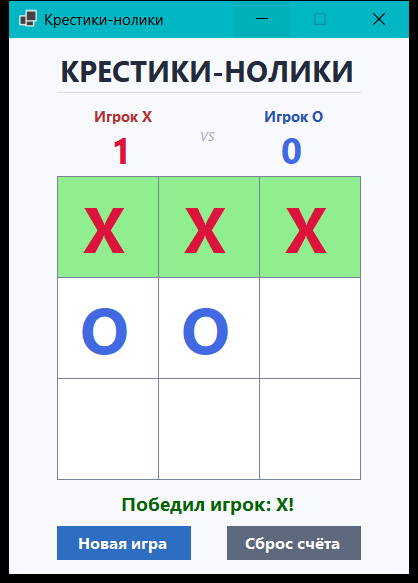
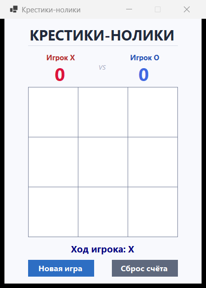
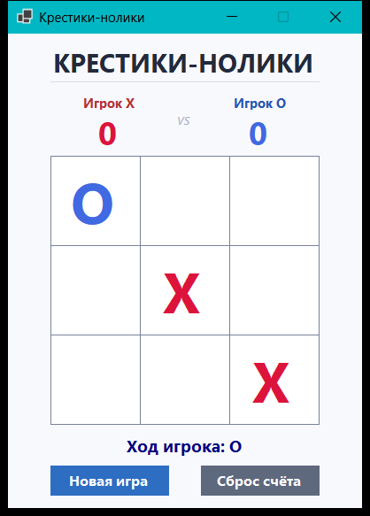
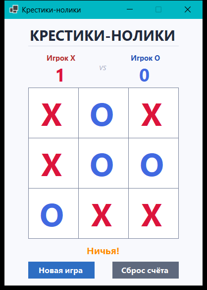

# Крестики-нолики · Tic-Tac-Toe

> Классическая игра «Крестики-нолики» для двух игроков на Windows.
> Реализована на **C#** с использованием **Windows Forms** (.NET 10).
 
<p align="center">
  
</p>

<p align="center">
  
  
  
  
</p>
 
--- 

## Возможности

- 🎮 Игровое поле **3×3** с кликабельными ячейками
- 🔴 Игрок **X** (красный) и 🔵 Игрок **O** (синий) — ходят по очереди
- ✅ Автоматическая проверка победителя по всем 8 линиям (строки, столбцы, диагонали)
- 🤝 Определение **ничьей** при полном заполнении поля
- 🌟 **Подсветка** выигрышной комбинации зелёным цветом
- 📊 **Накопительный счёт** между партиями
- 🔁 Кнопки «Новая игра» (сохраняет счёт) и «Сброс счёта»

---

## Скриншоты

| Старт | Игровой процесс |
|:---:|:---:|
|  |  |
| **Победа** | **Ничья** |
|  |  |

---

## Запуск

### Способ 1 — двойной клик (рекомендуется)

Откройте **`Run.bat`** двойным кликом — скрипт автоматически соберёт и запустит игру.

> ⚙️ Требуется установленный **[.NET SDK 8.0+](https://dotnet.microsoft.com/download)**.

### Способ 2 — командная строка

```powershell
cd TicTacToe
dotnet run -c Release
```

### Способ 3 — собрать автономный `.exe`

Если у получателя **не установлен .NET**, запустите **`Build.bat`** — он создаст
файл `release/TicTacToe.exe` (~70 МБ), который работает на любом
Windows-компьютере без установок.

---

## Алгоритм игры

```
       ┌──────────┐
       │  Старт   │
       └────┬─────┘
            ▼
   ┌─────────────────┐
   │ Инициализация:  │
   │ поле 3×3, X     │
   │ счёт 0:0        │
   └────┬────────────┘
        ▼
   ┌────────────┐
   │ Клик по    │◄──────┐
   │ ячейке     │       │
   └────┬───────┘       │
        ▼               │
    Ячейка            (нет)
    свободна? ────────►─┤
        │ (да)          │
        ▼               │
   Поставить X / O      │
        │               │
        ▼               │
    Три в ряд? ─(да)→ ПОБЕДА
        │ (нет)         │
        ▼               │
    Поле полное? ─(да)→ НИЧЬЯ
        │ (нет)         │
        ▼               │
    Сменить игрока ─────┘
```

Сложность проверки победителя — **O(1)** (фиксированное число из 8 линий,
размер поля не меняется).

---

## Технологический стек

| Компонент       | Назначение                                    |
|-----------------|-----------------------------------------------|
| **C# 12**       | Язык программирования                         |
| **.NET 10**     | Платформа выполнения                          |
| **Windows Forms** | Графический интерфейс                       |
| **GDI+**        | Отрисовка элементов                           |

---

## Структура проекта

```
Tic-tac-toe/
├── TicTacToe/                ← исходный код приложения
│   ├── Form1.cs                игровая логика (обработчики, проверки)
│   ├── Form1.Designer.cs       описание интерфейса (компоненты)
│   ├── Program.cs              точка входа
│   └── TicTacToe.csproj        файл проекта .NET
├── screenshots/              ← скриншоты для README
│   ├── 01_start.png
│   ├── 02_gameplay.png
│   ├── 03_win.png
│   └── 04_draw.png
├── Run.bat                   ← запуск игры (двойной клик)
├── Build.bat                 ← сборка автономного .exe
├── .gitignore
└── README.md
```

---

## Дизайн

- **Фон:** светло-серый `#F8F9FD`
- **Игрок X:** Crimson `#DC143C`
- **Игрок O:** RoyalBlue `#4169E1`
- **Победная линия:** LightGreen
- **Шрифт:** Segoe UI
- **Размер окна:** 400 × 608 px (фиксированный)

Разметка построена на математически точных константах:
ячейки `100×100 px` с зазором `1 px`, что даёт идеально ровную сетку `3×100 + 4×1 = 304 px`.

---

## Автор

**Туденов Имран**

Курсовая работа по дисциплине «Алгоритмические языки программирования»,
КГУСТА им. Н. Исанова, 2026.

---

## Лицензия

[MIT License](LICENSE) — используйте свободно.
